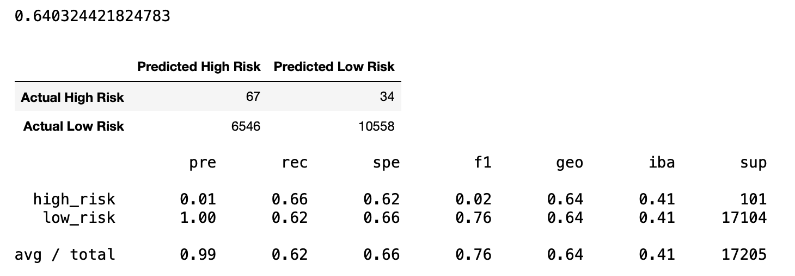
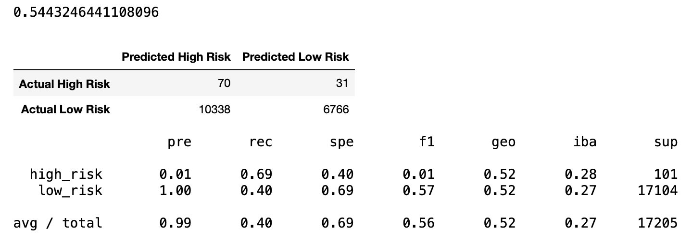
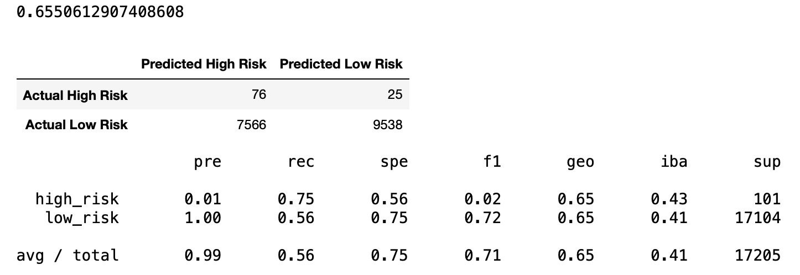
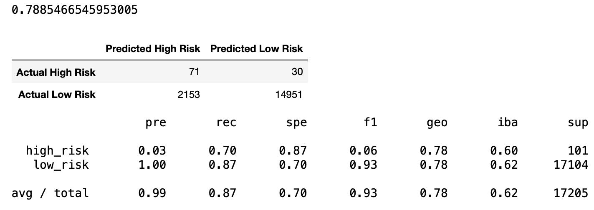
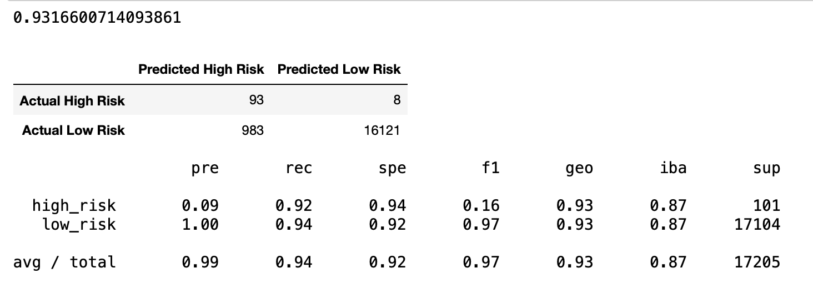

# Credit_Risk_Analysis
UCB Challenge: Use skills in data preparation, statistical reasoning, and machine learning snd apply this in evaluating credit risk while using imbalanced-learn and scikit-learn libraries to build and evaluate models using resampling.
 
 
# Overview of the Analysis 
With the dataset given to us from Lending Club, a peer-to-peer lending services company, we were given the task to evaluate credit risk. We utilized six different algorithms in our methodology for sampling the data. We oversampled the data using the RandomOverSampler and SMOTE algorithms, and undersampled the data using the ClusterCentroids algorithm. Then, used a combinatorial approach of over-and undersampling using the SMOTEENN algorithm. We also used the BalancedRandomForestClassifier and EasyEnsembleClassifier, to predict credit risk. 

Finally, we need to evaluate the performance of these models and make a written recommendation on whether they should be used to predict credit risk.

# Results
For each model or algorithm, its corresponding Balanced Accuracy Score, Confusion Matrix and Classification Report is presented, along with a brief summary of what is contained in the three reports. The values in the summary are expressed in percentages, having 2 significant figures when possible and no decimals.

## Naive Random Oversampling Algorithm

* The balanced accuracy score for this algorithm is 64%.
* The precision score for the high-risk category is 1%, recall score is 66% and an F1 score of 2%  
* The precision score is at 100%, recall score is at 62% and an F1 score of 76% for the low-risk category.

## SMOTE Oversampling Algorithm

* The balanced accuracy score is 65%.
* The precision score for the high-risk category is 1%, recall score is 61% and an F1 score of 2%.
* The precision score is at 100%, recall score is at 69% and an F1 score of 81% for the low-risk category.

## Cluster Centroids Algorithm

* The balance accuracy score is 54%. Among the six models, this is the lowest balance accuracy score.
* The precision score for the high-risk category is 1%, recall score is 69% and an F1 score of 1%.
* The precision score is at 100%, recall score is at 40% and an F1 score of 57% for the low-risk category.

## SMOTEENN Algorithm

* The balance accuracy score is 66%.
* The precision score for the high-risk category is 1%, recall score is 75% and an F1 score of 2%.
* The precision score is at 100%, recall score is at 56% and an F1 score of 72% for the low-risk category.

## BalancedRandomForestClassifier

* The balanced accuracy score is 79%. Compared to the first four algorithms, this one produced a better balanced accuracy score.
* The precision score for the high-risk category is 3%, recall score is 70% and an F1 score of 6%.
* The precision score is at 100%, recall score is at 87% and an F1 score of 93% for the low-risk category.

## EasyEnsembleClassifier

* The balanced accuracy score is 93%, which is the highest of all six models.
* The precision score for the high-risk category is 9%, recall score is 92% and an F1 score of 16%.
* The precision score is at 100%, recall score is at 94% and an F1 score of 97% for the low-risk category.

# Summary

All the models used to perform the credit risk analysis show weak precision in determining if an individual's credit risk is high. The first four models had a precision score of 1% and although it imporved a bit if the balanced random forest classifier(3%) or the easy ensemble classifier(9%) was used, Using precision as a sole basis for evaluating which model to use would not produce valid and relaible results. We will take a look and compare at the balance accuracy scores and the recall scores for both high and low credit risk. 

The accuracy score tells us how well the model performs in general. The models/algoriths listed below are the ones that showed the highest scores.
* Easy Ensemble Classify (93%)
* Balanced Random Forest Classifying (79%)
* SMOTEENN Sampling (66%)

Looking through the different models, we look at the the ones that scored the highest for recall rate for high credit risks.
* Easy Ensemble Classifier (92%)
* SMOTEENN Sampling (75%)
* Balanced Random Forest Classifier (70%)

Another important statistic to look at when comparing the models is the recall rate for low credit risks. This score in this category shows how many low-risk credit (individuals) are flagged as high risk. Looking through the different models, the ones that scored the highest were:
* Easy Ensemble Classifier (94%)
* Balanced Random Forest Classifying (100%)
* SMOTE Oversampling (69%)

It looks like the Easy Ensemble Classifying Model has the best balance of all the models for predicting credit risk because of it's high accuracy score and good balance of recall scores for both high and low risk loans.

